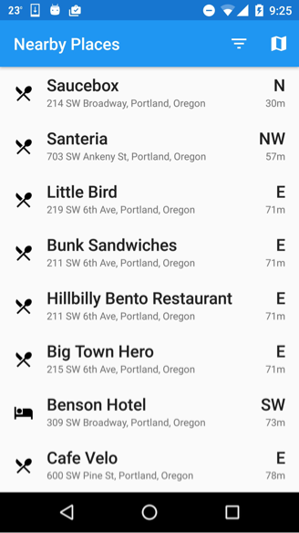
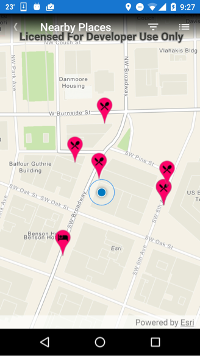
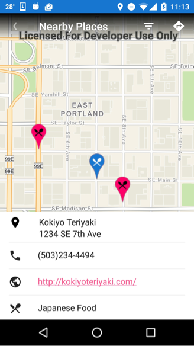
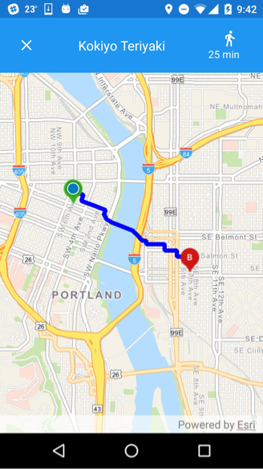

# Nearby Places
Explore the world around you.

## Description
Customize your exploration of places around you using [Esri’s World Geocoding Service](https://developers.arcgis.com/features/geocoding/) or your own [custom geocoding service](http://desktop.arcgis.com/en/arcmap/latest/manage-data/geocoding/the-geocoding-workflow.htm). The app uses Esri’s geocoding service to find hotels, restaurants or bars within a default radius of the device’s current location and provides routing directions to a selected place of interest. The ArcGIS Android Geometry Engine API is used to sort the list of places based on distance and bearing from the device’s location.

The example application is open source and available on GitHub. You can modify it to display [categories](https://developers.arcgis.com/rest/geocode/api-reference/geocoding-category-filtering.htm) of places you care about or [configure](http://desktop.arcgis.com/en/arcmap/latest/manage-data/geocoding/creating-an-address-locator.htm) your own custom locator.

## Identifying Places Nearby

### Device Location
The nearby-app uses a [mapless app pattern](https://developers.arcgis.com/android/guide/determine-your-app-map-pattern.htm#ESRI_SECTION1_58C46384E3484890A47629F8F12E6EF5) by first presenting a list of nearby places.  Since the app starts with a list, rather than a map, the device location is obtained using Google’s Location Services API. In the future, the Runtime SDK can be used to obtain the device location outside of the `MapView`.  Before trying to obtain the device location, the app checks that the device's GPS and wireless settings are turned on and then configures Google's location service.

```java
// Google's location services are configured in the
// PlacesFragment onCreate method.
if (mGoogleApiClient == null) {
    // Create an instance of GoogleAPIClient.
    mGoogleApiClient = new GoogleApiClient.Builder(getActivity())
      .addConnectionCallbacks(this)
      .addOnConnectionFailedListener(this)
      .addApi(LocationServices.API)
      .build();
}
// Once Google's location service is connected,
// you can use the device location to start the
// geocoding search.
@Override public void onConnected(@Nullable Bundle bundle) {
    mLastLocation = LocationServices.FusedLocationApi.getLastLocation(mGoogleApiClient);
    startSearch(mLastLocation);
}
```
Once a location is obtained, a search for places can begin.

### Geocoding
The search for places uses category filters (e.g. “Hotel”, “Food”, “Pizza”) to find places matching these types near the current device location. The World Geocoding service uses a hierarchical structure of categories allowing high level concepts, like a category level 1 descriptor (e.g. “POI” for place of interest) to be searched as well as more specific category level 3 types like “Brazilian Food” or “Science Museum” to be used. The category filters and other search criteria are defined using the SDK’s [Geocode Parameters](https://developers.arcgis.com/android/latest/api-reference/reference/com/esri/arcgisruntime/tasks/geocode/GeocodeParameters.html).

The geocode parameters are configured with the maximum number of results to return, the desired categories, the device's current location, and [output fields](https://developers.arcgis.com/rest/geocode/api-reference/geocoding-service-output.htm#ESRI_SECTION1_42D7D3D0231241E9B656C01438209440) using the following pattern.  Note that the geocoding service supports a specific list of categories defined [here](https://developers.arcgis.com/rest/geocode/api-reference/geocoding-category-filtering.htm#ESRI_SECTION1_502B3FE2028145D7B189C25B1A00E17B).  In the nearby-app, we're interested in the top 10 results within a radius of 50 kilometers of the current location.

```java
GeocodeParameters parameters = new GeocodeParameters();

// We're interested in the top ten nearest places
parameters.setMaxResults(10);

// This limits the search to a radius of 50 kilometers
// around the current location.
parameters.setPreferredSearchLocation(mCurrentLocation);

// Retrieve a mutable list
List categories = parameters.getCategories();

// Add a subset of specific keyword categories
// known to the service. See reference above.
categories.add("Food");
categories.add("Hotel");
categories.add("Pizza");
categories.add("Coffee Shop");
categories.add("Bar or Pub");

List outputAttributes = parameters.getResultAttributeNames();
// Return all of the service output fields
outputAttributes.add("*");

// Execute the search[]
<ListenableFuture> results = mLocatorTask.geocodeAsync(searchText, parameters);
```
A distance and bearing from the device's location is calculated for each returned place.

### Calculating Bearing and Distance
To determine distance and bearing, the [geometry engine](https://developers.arcgis.com/android/latest/api-reference/reference/com/esri/arcgisruntime/geometry/GeometryEngine.html) is used to calculate the [geodesic distance](https://geonet.esri.com/groups/coordinate-reference-systems/blog/2014/09/01/geodetic-distances-how-long-is-that-line-again) between the device location and each nearby point of interest. Measuring distance, determining spatial relationships, and altering geometries can be done locally on the mobile client.

When using the current device location in geospatial calculations, a spatial reference must be defined since the location returned by Google's location service doesn't specify a spatial reference.
```java
LinearUnit linearUnit = new LinearUnit(LinearUnitId.METERS);
AngularUnit angularUnit = new AngularUnit(AngularUnitId.DEGREES);

//The current location is obtained from the Google Location API 
//needs to be created as a new point with a spatial reference.


// Get the spatial reference from the place returned from the geocoding service
SpatialReference spatialReference = place.getLocation().getSpatialReference() ;

// Create a new Point and use it for spatial calculations
Point newPoint = new Point(mCurrentLocation.getX(), mCurrentLocation.getY(), spatialReference );

GeodesicDistanceResult result =GeometryEngine.distanceGeodesic(newPoint, place.getLocation(),linearUnit, angularUnit, GeodeticCurveType.GEODESIC);
double distance = result.getDistance();
place.setDistance(Math.round(distance));

// Bearing degrees are returned in a range between -180 to 180.
double degrees = result.getAzimuth1();
if (degrees > -22.5  && degrees <= 22.5){
    bearing = "N";
}else if (degrees > 22.5 && degrees <= 67.5){
    bearing = "NE";
}else if (degrees > 67.5 && degrees <= 112.5){
    bearing = "E";
}else if (degrees > 112.5 && degrees <= 157.5){
    bearing = "SE";
}else if( (degrees > 157.5 ) || (degrees <= -157.5)){
    bearing = "S";
}else if (degrees > -157.5 && degrees <= -112.5){
    bearing = "SW";
}else if (degrees > -112.5 && degrees <= -67.5){
    bearing = "W";
}else if (degrees > -67.5 && degrees <= -22.5){
    bearing = "NW";
}
```

With bearing and distance assigned, places are shown in the List View.


       |  |          

Clicking on the map icon will display the nearby places in the map view.

## Displaying Places in the Map
### Deriving a Viewpoint
When the user clicks on the map icon to view the map, the map viewpoint is derived based on the locations in the list view.  This is done by iterating over the found places, creating a `Multipoint` object, and then using the GeometryEngine's buffer method to generate a `Polygon`.  From the `Polygon`, a rectangular area with a spatial reference can be obtained and passed to the map view.


```java
List<Point> points = new ArrayList<>();


// Create an array of Point objects based on place locations
for ( Place place : places){
     points.add(place.getLocation());
}
// Create a Multipoint object and then buffer it to create a polygon
Multipoint mp = new Multipoint(points);
Polygon polygon = GeometryEngine.buffer(mp, 0.0007);

// Get the envelope from the polygon
Envelope viewpoint = polygon.getExtent();
```
### Location Display
Once we have a MapView, we can set the `Viewpoint` and leverage the SDK's `LocationDisplay`. The desired behavior is to have the `MapView` change the visible area to the current extent and display the device location.  Currently you have to wait for the `MapView` draw status to be completed in order to use the `Viewpoint` with the location display. 

```
mMapView = (MapView) root.findViewById(R.id.map);
ArcGISMap map = new ArcGISMap(Basemap.createNavigationVector());
mMapView.setMap(map);

// Set view point first
mMapView.setViewpoint(mViewpoint);

// Wait for draw status to be complete before getting and
// starting location display.
mMapView.addDrawStatusChangedListener(new DrawStatusChangedListener() {
   @Override public void drawStatusChanged(final DrawStatusChangedEvent drawStatusChangedEvent) {
        if (drawStatusChangedEvent.getDrawStatus() == DrawStatus.COMPLETED){
          mLocationDisplay = mMapView.getLocationDisplay();
          mLocationDisplay.startAsync();
        }
    }
});
```

### Refreshing the Map View with New Search Results
As the user taps or pans the map, the app either displays details for a tapped place or a `SnackBar` is displayed and a  new search is initiated for the panned location. Navigation changes are monitored by attaching a `NavigationChangedListener` to the `MapView`.  With each event received, we check the `MapView.isNavigating()` method and in the case where a user uses a [fling gesture](https://developer.android.com/training/gestures/detector.html) to pan the map there is a slight pause before the fling that results in the method returning false as the API does not currently account for the delay.  To work around this, we add logic to the message queue and execute after 50 milliseconds which ensures fling gestures are captured.

```java
// This is a workaround for detecting when a fling motion has completed on the map view. The
// NavigationChangedListener listens for navigation changes, not whether navigation has completed. We wait
// a small interval before checking if map is view still navigating.

mNavigationChangedListener = new NavigationChangedListener() {

  @Override public void navigationChanged(final NavigationChangedEvent navigationChangedEvent) {
   if (!mMapView.isNavigating()){
     Handler handler = new Handler();
     handler.postDelayed(new Runnable() {

       @Override public void run() {

         if (!mMapView.isNavigating()) {
           onMapViewChange();
         }
       }
     }, 50);
   }
  }
};
mMapView.addNavigationChangedListener(mNavigationChangedListener);
```

Each time a search is initiated from the map view, the found places are constrained to the current visible area of the map using the `GeometryEngine`'s within method.

```java
Envelope visibleMapArea = mapView.getVisibleArea().getExtent();

// Only show places within the visible map area
Point placePoint = new Point(location.getX(),location.getY(), SpatialReferences.getWgs84());
if (GeometryEngine.within(placePoint,visibleMapArea)){
  places.add(place);
}else{
  Log.i("GeometryEngine", "***Excluding " + place.getName() + " because it's outside the visible area of map.***");
}

```
## Routing
A walking route is generated for a place by tapping on the routing arrow in the upper right hand corner of the toolbar.

       |  |          


Getting navigation directions in the nearby-app is just as easy in the [Runtime SDK](https://developers.arcgis.com/features/directions/) as it is on [ArcGIS Online](http://doc.arcgis.com/en/arcgis-online/use-maps/get-directions.htm).  A good example of how to set this up is found in the [maps-app](https://github.com/Esri/maps-app-android/blob/master/maps-app/README.md) so we won't discuss it here.  In contrast to the maps-app, the nearby-app demonstrates how to set up a request for a walking route using travel modes and restrictions in the routing request.

```java

RouteParameters routeParameters = routeTaskFuture.get();

// Explicity set the travel mode attributes for a walking route
TravelMode mode = routeParameters.getTravelMode();
mode.setImpedanceAttributeName("WalkTime");
mode.setTimeAttributeName("WalkTime");

// Setting the restriction attributes for walk times
List<String> restrictionAttributes = mode.getRestrictionAttributeNames();
restrictionAttributes.clear();

// The following three items are required for generating
// walking routes.
restrictionAttributes.add("Avoid Roads Unsuitable for Pedestrians");
restrictionAttributes.add("Preferred for Pedestrians");
restrictionAttributes.add("Walking");

routeParameters.setTravelMode(mode);

ListenableFuture<RouteResult> routeResFuture = routeTask.solveRouteAsync(routeParameters);
```
Getting and setting attribute lists highlights a common pattern throughout the SDK, the use of mutable collections to control a variety of settings. Examples of this were shown in the Geocoding section above and prevalent throughout the nearby-app. Manipulating graphic overlays for displaying routing results and adding graphics to the map is another area where the pattern occurs.
```java
// Showing the route result, the route overlay is added
// only once.  Subsequent access is via "getGraphcis"

if (mRouteOverlay == null) {
    mRouteOverlay = new GraphicsOverlay();
    mMapView.getGraphicsOverlays().add(mRouteOverlay);
}else{
    // Clear any previous route
    mRouteOverlay.getGraphics().clear();
}

//Adding graphics to the map
BitmapDrawable pin = (BitmapDrawable) ContextCompat.getDrawable(getActivity(),getDrawableForPlace(place)) ;
PictureMarkerSymbol pinSymbol = new PictureMarkerSymbol(pin);
Point graphicPoint = place.getLocation();
Graphic graphic = new Graphic(graphicPoint, pinSymbol);
mGraphicOverlay.getGraphics().add(graphic);
```
